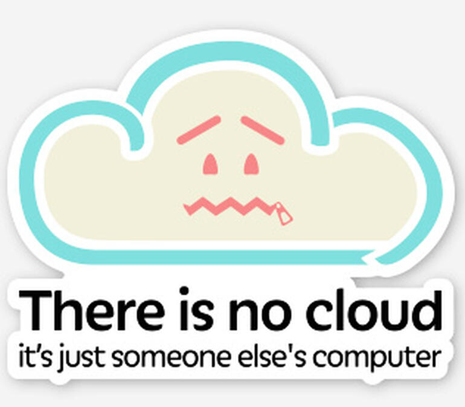

# Cloud Basics

## What Is The Cloud?

A "cloud" is a collection of resources that exist in some other system, are generally on-demand, and don't need to be managed by you at the hardware level. 

Clouds can be public (GCP, AWS), private (Corporate proprietary, OpenStack, etc) or a mix of public/private/on-prem (hybrid cloud, Openshift).

[next](./2x1.md)