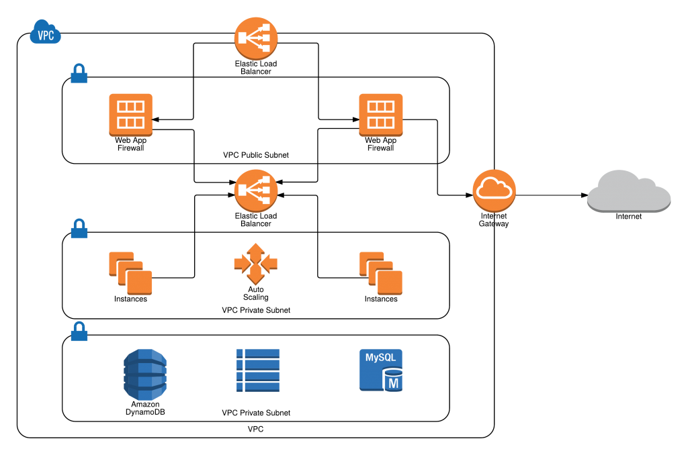
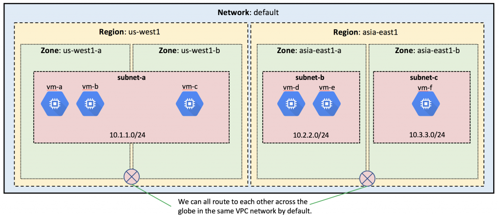

## Learning Cloud A vs Cloud B

Learning multiple clouds can be challenging. Learning and understanding some fundamental concepts of the cloud will make things easier:

  * IAM (Least privilege)
  * Encryption at rest and in transit (envelope encryption)
  * SDNs/Network level segmentation
  * Routing
  * Compute
  * Storage

This mindset will make it easier to adapt to multiple clouds and make you a better cloud security architect. Many people complain about GCP and how "complex" it is because they learned AWS first and are heavy into the way AWS does stuff. Understanding basic cloud concepts gives you the context needed to avoid this problem. 

For example, all clouds have the idea of a VPC:

### AWS VPC

### GCP VPC

As you can see, there are many differences but the general ideas are the same. There is a concept of a perimeter, subnets, zones, etc. You will find that at a high level, most public clouds are the same. The main differences are the implementations of the points above. Once you understand the fundamental concepts, you can start learning the cloud-specific implementations.

For example, AWS best practice for IAM is to craft bespoke, minimal policies instead of using their managed policies. GCP best practice is to use their managed predefined roles. AWS VPCs are regional and require work to set up globally. GCP VPCs are global by default so it is much easier to make a globally routable network.

## You Probably Don't Need Multi-Cloud

Multi-Cloud means you have the same kinds of resources in two or more clouds for HA, DR, or avoiding "vendor lock-in".  Multi-Cloud is practical in only a few scenarios:

* You have unlimited money
  * You can hire AWS and GCP experts to duplicate infrastructure and code
* You have a 99.9999999% SLA to customers
  * You must basically be always available
  * You need minimal latency between clients and servers and need specific regions
* You need specific cloud services from each CSP (AI from GCP and Data warehouse in AWS)

Multi-cloud places extra burden on security teams because it isn't just double the work, it is two sets of hard problems to solve. It is already next to impossible to hire a competent security professional. Imagine trying to hire one that knows two clouds well enough to secure them (This is definitely not foreshadowing to why cloud consulting is good for you). Consider your actual business needs before deciding to host resources in multiple clouds.

Multi-cloud should not be confused with a totally valid hybrid cloud approach. Many companies deploy a "hybrid cloud" solution where sensitive data is stored on-prem and compute and elastic storage is used in the cloud. This can be for security, governance, or cost purposes. CSPs make this easy, especially GCP, with direct connection methods, on-prem hardware, VPNs, Anthos.

[next](./3.md)