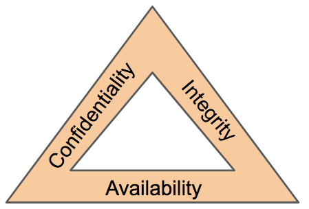

# Security in the Cloud vs On-Prem

CSPs generally follow the "shared responsibility model". This means there are things they take care of, and there are things you take care of.

## Things you don't need to worry about
  * Physical objects like servers, locks, hard drives
  * Power
  * Cooling
  * Physical connections like switches and cabling
  * Hardware upgrades and maintenance

## Things you need to worry about
  * Hardening of your application layer
  * Authentication/Authorization
  * Public/private access
  * Credential leakage
  * Cloud Governance (protecting resources on shared hardware, snooping, etc)
  * Availability and capacity

## Things that are a lot easier
  * High-availability 
  * IAM
  * Encryption
  * Secrets Management
  * Containers
  * Serverless
  * IaC and scanning
  * Policy as code
  * Automated remediation

[next](./4.md)